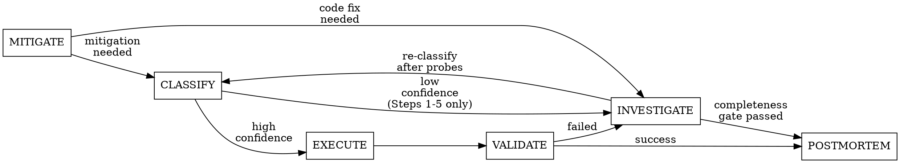

# Incident-Analysis Skill Refactor — Implementation Plan

> **For agentic workers:** REQUIRED SUB-SKILL: Use superpowers:subagent-driven-development (recommended) or superpowers:executing-plans to implement this plan task-by-task. Steps use checkbox (`- [ ]`) syntax for tracking.

**Goal:** Reduce `skills/incident-analysis/SKILL.md` from 12,806 words to ~11,300 words (~12% reduction) through targeted extractions, prose compression, and a stage-transition flowchart — while keeping all 13 behavioral constraints and the Step 5 hypothesis spine inline.

**Architecture:** 2 new reference files, 6 targeted edits to SKILL.md, test retargeting in `tests/test-incident-analysis-content.sh`, word-count guard lowered, behavioral verification against eval fixtures. Each task updates tests alongside the SKILL.md change so interim test runs pass.

**Tech Stack:** Markdown, Bash tests. Verification: `bash tests/test-incident-analysis-content.sh` (170 assertions) + behavioral eval cross-check.

**Word-count budget:**

| Change | Words removed | Pointer words added | Net |
|--------|-------------|--------------------|----|
| Task 1: Error taxonomy extraction | 595 | 85 | -510 |
| Task 2: Deep-dive branches extraction | 661 | 75 | -586 |
| Task 3: Postmortem permalink trimming | 56 | 30 | -26 |
| Task 4: Constraint compression (2,6,7,8,13) | ~385 | 0 | -385 |
| Task 5: Step 3c schema shortening | 83 | 45 | -38 |
| Task 6: Stage flowchart (addition) | 0 | 70 | +70 |
| **Total** | **~1,780** | **~305** | **~-1,475** |

**Expected result:** 12,806 − 1,475 ≈ **11,330 words**. Guard set at 11,500.

---

## Pre-Execution: Verify Baseline

Before any changes, verify all 170 tests pass:

```bash
bash tests/test-incident-analysis-content.sh
```

Expected: `Tests passed: 170 / Tests failed: 0`

---

### Task 1: Extract Error Taxonomy and Exit Codes to Reference File

**Files:**
- Create: `skills/incident-analysis/references/error-taxonomy.md`
- Modify: `skills/incident-analysis/SKILL.md:456-481`
- Modify: `tests/test-incident-analysis-content.sh:314-319`

**What moves:** The 3-tier error taxonomy table, message broker signals paragraph, quantitative baseline verification paragraph, and container exit code table (SKILL.md lines 456–481). These are reference-lookup material, not investigation-spine instructions.

**What stays in SKILL.md:** A compressed summary (~85 words) that preserves all test-matched patterns except 2 (retargeted).

- [ ] **Step 1: Write failing tests for new reference file**

Add to `tests/test-incident-analysis-content.sh` after the existing "Exit code taxonomy" block (after line 38). Insert a new section:

```bash
# ---------------------------------------------------------------------------
# references/error-taxonomy.md — Extracted taxonomy and exit codes
# ---------------------------------------------------------------------------
ERROR_TAXONOMY_REF="${PROJECT_ROOT}/skills/incident-analysis/references/error-taxonomy.md"
assert_file_exists "references/error-taxonomy.md exists" "${ERROR_TAXONOMY_REF}"
assert_file_contains "error-taxonomy ref: has tier table" "Tier.*Type.*Diagnostic value" "${ERROR_TAXONOMY_REF}"
assert_file_contains "error-taxonomy ref: has exit code table" "Exit Code.*Signal.*Meaning" "${ERROR_TAXONOMY_REF}"
assert_file_contains "error-taxonomy ref: mentions poison-pill" "poison.pill" "${ERROR_TAXONOMY_REF}"
assert_file_contains "error-taxonomy ref: baseline verification rule" "not evidence.*query the baseline" "${ERROR_TAXONOMY_REF}"
```

- [ ] **Step 2: Retarget 2 existing tests from SKILL.md to reference file**

In `tests/test-incident-analysis-content.sh`, change these 2 assertions to point at the new file:

```bash
# Line 314-315: change ${SKILL_FILE} → ${ERROR_TAXONOMY_REF}
assert_file_contains "error-taxonomy ref: message broker mentions poison-pill" \
    "poison.pill" "${ERROR_TAXONOMY_REF}"

# Line 318-319: change ${SKILL_FILE} → ${ERROR_TAXONOMY_REF}
assert_file_contains "error-taxonomy ref: Tier 3 forbids unverified dismissal" \
    "not evidence.*query the baseline" "${ERROR_TAXONOMY_REF}"
```

Also update the old test descriptions to indicate they now check the reference file (not "SKILL.md: ...").

- [ ] **Step 3: Run tests to verify they fail**

Run: `bash tests/test-incident-analysis-content.sh`
Expected: 6 failures — 4 new assertions (file doesn't exist) + 2 retargeted assertions (file doesn't exist).

- [ ] **Step 4: Create `references/error-taxonomy.md`**

Move SKILL.md lines 456–481 verbatim (the tier table through the exit code routing paragraph) into the new file. Add a title heading:

```markdown
# Error Taxonomy and Exit Code Guide

Extracted from SKILL.md Step 2 (Extract Key Signals). Referenced inline from the investigation spine.
```

Then paste lines 456–481 (starting from `**Error taxonomy — prioritize by diagnostic value:**` through `Use exit codes to route investigation before proposing mitigation.`).

- [ ] **Step 5: Replace extracted content in SKILL.md with compressed pointer**

Replace SKILL.md lines 456–481 with this compressed summary:

```markdown
**Error taxonomy — prioritize by diagnostic value:** Classify signals into Tier 1 (anomalous — trigger indicators), Tier 2 (infrastructure — where it's breaking), Tier 3 (expected — at verified baseline rates). Investigate Tier 1 first. Message broker signals are always Tier 1 — trace to consumer's exception before investigating downstream infrastructure symptoms. Tier 3 requires a verified baseline rate comparison; "this looks like it always happens" is not evidence — query the baseline rate. Container exit codes (0, 1, 137/OOMKilled, 139/SIGSEGV, 143/SIGTERM) guide investigation routing. Full taxonomy, exit code guide, and routing rules: `references/error-taxonomy.md`.
```

- [ ] **Step 6: Run tests to verify they pass**

Run: `bash tests/test-incident-analysis-content.sh`
Expected: All pass (170 + 4 new = 174).

Pattern preservation check:
- `"exit code"` → ✓ in pointer
- `"137"` → ✓ in pointer
- `"139"` → ✓ in pointer
- `"143"` → ✓ in pointer
- `"Message broker signals.*always Tier 1"` → ✓ in pointer
- `"poison.pill"` → ✓ retargeted to ref
- `"verified baseline"` → ✓ in pointer
- `"not evidence.*query the baseline"` → ✓ retargeted to ref

- [ ] **Step 7: Commit**

```bash
git add skills/incident-analysis/references/error-taxonomy.md skills/incident-analysis/SKILL.md tests/test-incident-analysis-content.sh
git commit -m "refactor(incident-analysis): extract error taxonomy and exit codes to reference file"
```

---

### Task 2: Extract Deep-Dive Branches to Reference File

**Files:**
- Create: `skills/incident-analysis/references/deep-dive-branches.md`
- Modify: `skills/incident-analysis/SKILL.md:533-579`
- Modify: `tests/test-incident-analysis-content.sh:51-62`

**What moves:** CrashLoopBackOff triage procedure, probe/startup-envelope checks, and pod-start failure branch (SKILL.md lines 533–579). These are conditional sub-playbooks with step-by-step procedures — reference material, not investigation-spine decisions.

**What stays in SKILL.md:** A routing summary (~75 words) that names the branches, lists redirect conditions, and points to the reference file. This preserves the investigation flow and key test patterns.

- [ ] **Step 1: Write failing tests for new reference file**

Add to `tests/test-incident-analysis-content.sh` after the new error-taxonomy section:

```bash
# ---------------------------------------------------------------------------
# references/deep-dive-branches.md — Extracted conditional branches
# ---------------------------------------------------------------------------
DEEP_DIVE_REF="${PROJECT_ROOT}/skills/incident-analysis/references/deep-dive-branches.md"
assert_file_exists "references/deep-dive-branches.md exists" "${DEEP_DIVE_REF}"
assert_file_contains "deep-dive ref: has crashloop triage" "CrashLoopBackOff" "${DEEP_DIVE_REF}"
assert_file_contains "deep-dive ref: has probe checks" "initialDelaySeconds" "${DEEP_DIVE_REF}"
assert_file_contains "deep-dive ref: has pod-start failure" "ImagePullBackOff" "${DEEP_DIVE_REF}"
assert_file_contains "deep-dive ref: has imagePullSecrets check" "imagePullSecrets" "${DEEP_DIVE_REF}"
```

- [ ] **Step 2: Retarget 4 existing tests from SKILL.md to reference file**

In `tests/test-incident-analysis-content.sh`, change these assertions:

```bash
# Line 52: retarget probe initialDelaySeconds
assert_file_contains "deep-dive ref: probe checks initialDelaySeconds" \
    "initialDelaySeconds" "${DEEP_DIVE_REF}"

# Line 53: retarget probe timeoutSeconds
assert_file_contains "deep-dive ref: probe checks timeoutSeconds" \
    "timeoutSeconds" "${DEEP_DIVE_REF}"

# Line 54: retarget dependency reachability
assert_file_contains "deep-dive ref: probe checks dependency reachability" \
    "[Dd]ependency reachability" "${DEEP_DIVE_REF}"

# Line 62: retarget imagePullSecrets
assert_file_contains "deep-dive ref: pod-start mentions imagePullSecrets" \
    "imagePullSecrets" "${DEEP_DIVE_REF}"
```

- [ ] **Step 3: Run tests to verify they fail**

Run: `bash tests/test-incident-analysis-content.sh`
Expected: 8 failures — 4 new + 4 retargeted.

- [ ] **Step 4: Create `references/deep-dive-branches.md`**

Move SKILL.md lines 533–579 verbatim into the new file. Add a title:

```markdown
# Deep-Dive Branches — Conditional Investigation Procedures

Extracted from SKILL.md Step 3 (Single-Service Deep Dive). These conditional branches execute when specific signals are present. Referenced inline from the investigation spine.
```

Then paste lines 533–579 (from `**CrashLoopBackOff triage (conditional...` through `Do not propose restart or rollback from this branch.`).

- [ ] **Step 5: Replace extracted content in SKILL.md with compressed pointer**

Replace SKILL.md lines 533–579 with:

```markdown
**CrashLoopBackOff triage (conditional — when `crash_loop_detected` signal is present):** Complete the diagnostic sequence in `workload-restart` playbook's `investigation_steps` before proposing restart: pod describe → events → termination reason and exit code → previous container logs → deployment/probe config → rollout history correlation. Redirect to other playbooks when evidence warrants (OOMKilled → resource, stack trace after deploy → bad-release, ImagePullBackOff/CreateContainerConfigError → pod-start failure). Full CrashLoopBackOff triage, probe/startup-envelope checks, and pod-start failure branch: `references/deep-dive-branches.md`.
```

- [ ] **Step 6: Run tests to verify they pass**

Run: `bash tests/test-incident-analysis-content.sh`
Expected: All pass (174 + 4 new = 178).

Pattern preservation check:
- `"CrashLoopBackOff triage"` → ✓ in pointer
- `"previous"` → ✓ "previous container logs" in pointer
- `"[Tt]ermination reason"` → ✓ "termination reason" in pointer
- `"rollout history"` → ✓ in pointer
- `"startup-envelope"` → ✓ in pointer
- `"Pod-start failure"` → ✓ "pod-start failure" in pointer
- `"ImagePullBackOff"` → ✓ in pointer + skill description
- `"CreateContainerConfigError"` → ✓ in pointer + skill description
- `"workload-restart.*investigation_steps"` → ✓ in pointer
- Section-scoped CrashLoopBackOff in INVESTIGATE → ✓ pointer is in Step 3

- [ ] **Step 7: Commit**

```bash
git add skills/incident-analysis/references/deep-dive-branches.md skills/incident-analysis/SKILL.md tests/test-incident-analysis-content.sh
git commit -m "refactor(incident-analysis): extract deep-dive branches to reference file"
```

---

### Task 3: Trim Postmortem Evidence-Link Duplication

**Files:**
- Modify: `skills/incident-analysis/SKILL.md:1040-1043`

**What changes:** The permalink formatting section (3 bullet points repeating URL patterns already documented in `references/evidence-links.md`) is replaced with a one-line pointer. The carry-forward table and "Do not skip links" directive stay untouched.

- [ ] **Step 1: Replace permalink formatting section with pointer**

Replace SKILL.md lines 1040–1043 (from `**Permalink formatting (apply to all references...` through the `See references/evidence-links.md...` line) with:

```markdown
**Permalink formatting:** Use URL templates from `references/evidence-links.md` for all link types (logs, metrics, traces, deployments, source). For cross-project traces (Step 4), use each service's own project_id. Derive org/repo from `git remote get-url origin`.
```

- [ ] **Step 2: Run tests to verify they still pass**

Run: `bash tests/test-incident-analysis-content.sh`
Expected: All 178 pass. No test checks for the removed bullet points — all postmortem evidence-link tests target the carry-forward table and the "Do not skip links" directive which are preserved.

- [ ] **Step 3: Commit**

```bash
git add skills/incident-analysis/SKILL.md
git commit -m "refactor(incident-analysis): trim duplicated permalink formatting in POSTMORTEM"
```

---

### Task 4: Compress Behavioral Constraints

**Files:**
- Modify: `skills/incident-analysis/SKILL.md:34-40` (Constraint 2)
- Modify: `skills/incident-analysis/SKILL.md:87-98` (Constraint 6)
- Modify: `skills/incident-analysis/SKILL.md:100-113` (Constraint 7)
- Modify: `skills/incident-analysis/SKILL.md:127-131` (Constraint 8)
- Modify: `skills/incident-analysis/SKILL.md:200-203` (Constraint 13)

**What changes:** Tighten prose in Constraints 2, 6, 7, 8, and 13 while preserving all headers, core rules, and test-matched patterns. Target: ~385 words removed.

Constraint compression is sensitive — every test pattern must survive. The approach: remove explanatory prose and redundant phrasing, keep headers, rules, tables, and pattern-matched terms intact.

- [ ] **Step 1: Compress Constraint 2 (Scope Restriction, lines 38–40) — merge exception paragraphs**

Replace the two separate exception paragraphs with a single merged paragraph:

```markdown
**Bounded exceptions:** (a) Infrastructure escalation — when Step 3 identifies multi-pod failures indicating a node-level root cause, scope expands to the affected node(s) and their infrastructure signals. The completeness gate (Step 8, Q6) may require checking peer nodes. (b) Shared resource — when Step 2 identifies Tier 1 errors in adjacent services, or Step 3 identifies a shared resource under pressure, scope expands to the shared resource's known consumer set. Both escalations are bounded to specific implicated targets, not the entire cluster or organization.
```

- [ ] **Step 2: Compress Constraint 6 (Evidence Ledger, lines 87–98) — tighten procedure prose**

Replace the 3-item numbered re-query procedure and trailing paragraph with:

```markdown
Before issuing a query matching a prior entry: reuse if within `freshness_window_seconds` (default 300s), labeling output as `reused (collected at <UTC>)`. If stale, re-query and update.

**Mandatory re-query exceptions:** EXECUTE fingerprint recheck, VALIDATE sampling, and user-requested fresh data — always re-query live state.
```

- [ ] **Step 3: Compress Constraint 7 (Evidence-Only Attribution, lines 100–113) — remove replacement table**

The 4-row replacement table (`"likely caused by X"` → replacement) is reference detail. Replace lines 100–113 (from `### 7. Evidence-Only Attribution` through the self-check paragraph) with:

```markdown
### 7. Evidence-Only Attribution — No Speculative Causal Claims

Every causal claim in synthesis, YAML, and postmortem must reference a specific query result. Words like "likely", "probably", "possibly" are prohibited in final attribution — replace with evidence-backed language (`"caused by X (evidence: [result])"`) or move to `open_questions`. Speculative language IS permitted in intermediate notes where it drives the next query.

**Self-check:** Before emitting the Step 7 synthesis, scan for "likely", "probably", "possibly", "presumably", "may have", "might be" in causal sentences.
```

Test pattern check:
- `"Evidence-Only Attribution"` → ✓ in header
- `"likely.*prohibited"` → ✓ `"likely", "probably", "possibly" are prohibited`

- [ ] **Step 4: Compress Constraint 8 (MCP Result Processing, lines 127–131) — tighten rule 3**

Replace the detailed fallback chain with:

```markdown
3. **If a single MCP response is too large to process inline**, re-query with `page_size` halved (50 → 25 → 10) requesting only needed fields. At `page_size=10`, fall back to Tier 2 using Constraint 3's temp-file pattern.
```

- [ ] **Step 5: Compress Constraint 13 (Parallel Execution, line 203) — tighten anti-pattern**

Replace the anti-pattern paragraph with:

```markdown
**Anti-pattern:** Sequential single-service discovery through an intermediary (N round-trips) when all services could be discovered in one parallel batch.
```

- [ ] **Step 6: Run tests to verify they still pass**

Run: `bash tests/test-incident-analysis-content.sh`
Expected: All 178 pass. Test-matched patterns preserved:
- Constraint 6: `"Evidence Ledger"` ✓, `"freshness"` ✓, `"always re-query"` ✓, `"reused"` ✓
- Constraint 7: `"Evidence-Only Attribution"` ✓, `"likely.*prohibited"` ✓
- Constraint 8: `"MCP Result Processing"` ✓, `"Never read.*tool-results"` ✓, `"Evidence Ledger.*Constraint 6"` ✓

- [ ] **Step 7: Commit**

```bash
git add skills/incident-analysis/SKILL.md
git commit -m "refactor(incident-analysis): compress behavioral constraints prose"
```

---

### Task 5: Shorten Step 3c Schema Block

**Files:**
- Modify: `skills/incident-analysis/SKILL.md:641-648`

**What changes:** The layer status semantics table (4 rows) is replaced with a compressed one-liner + pointer to `references/investigation-schema.md`, which already defines these fields. The YAML block at lines 622–639 stays — it's a local step output contract.

- [ ] **Step 1: Replace table with compressed one-liner**

Replace SKILL.md lines 641–648 (from `**Layer status semantics:**` through the table) with:

```markdown
**Layer status semantics:** `assessed` = Minimum required evidence for that layer is complete (infrastructure: deployment history + runtime signal; application: ERROR logs queried + dominant exception class identified). Other statuses: `not_applicable`, `unavailable` (reason required), `not_captured` (reason required). Full definitions in `references/investigation-schema.md`.
```

- [ ] **Step 2: Run tests to verify they still pass**

Run: `bash tests/test-incident-analysis-content.sh`
Expected: All 178 pass. Pattern checks:
- `"assessed.*not_applicable.*unavailable.*not_captured"` → ✓ all four terms in the one-liner
- `"Minimum required evidence.*layer.*complete"` → ✓ preserved verbatim in the one-liner

- [ ] **Step 3: Commit**

```bash
git add skills/incident-analysis/SKILL.md
git commit -m "refactor(incident-analysis): shorten Step 3c layer status semantics"
```

---

### Task 6: Add Stage-Transition Flowchart

**Files:**
- Modify: `skills/incident-analysis/SKILL.md` (insert after the overview paragraph, before "## Behavioral Constraints")

**What changes:** A small `dot` flowchart showing the 6-stage pipeline with re-entry paths. This is the kind of non-obvious decision point that writing-skills says warrants a flowchart — the mode switches and CLASSIFY↔INVESTIGATE loop are hard to follow from prose alone.

- [ ] **Step 1: Insert flowchart after the overview paragraph (line 8)**

Insert between the overview paragraph (line 8) and the Quick Reference table (line 10):

```markdown
## Stage Flow



Key re-entry paths:
- **CLASSIFY < 60 → INVESTIGATE:** Only Steps 1–5 run. Steps 6–9 skipped. Findings feed back to CLASSIFY.
- **VALIDATE failed → INVESTIGATE:** Full Stage 2. The mitigation didn't work.
```

- [ ] **Step 2: Run tests to verify they still pass**

Run: `bash tests/test-incident-analysis-content.sh`
Expected: All 178 pass. Pure addition — no existing patterns affected.

- [ ] **Step 3: Commit**

```bash
git add skills/incident-analysis/SKILL.md
git commit -m "feat(incident-analysis): add stage-transition flowchart"
```

---

### Task 7: Lower Word Count Guard and Measure

**Files:**
- Modify: `tests/test-incident-analysis-content.sh:533`

- [ ] **Step 1: Measure final word count**

Run: `wc -w < skills/incident-analysis/SKILL.md`
Expected: ~11,200–11,400 words (see word-count budget table in header).

- [ ] **Step 2: Lower the word count guard**

In `tests/test-incident-analysis-content.sh` line 533, change:

```bash
if [ "$word_count" -le 13000 ]; then
```

to:

```bash
if [ "$word_count" -le 11500 ]; then
```

This locks in the ~12% reduction and prevents regression. The guard has ~200 words of headroom above the expected result to accommodate minor wording adjustments during implementation.

- [ ] **Step 3: Run full test suite**

Run: `bash tests/test-incident-analysis-content.sh`
Expected: All pass with the new guard.

Also run the full test suite:

Run: `bash tests/run-tests.sh`
Expected: All pass.

- [ ] **Step 4: Commit**

```bash
git add tests/test-incident-analysis-content.sh
git commit -m "test(incident-analysis): lower word count guard to 11,500 after refactor"
```

---

## Phase 2: Measure and Decide

After all Phase 1 tasks complete:

1. Re-read the trimmed SKILL.md end-to-end
2. Measure: `wc -w < skills/incident-analysis/SKILL.md`
3. If > 11,500 words, investigate which compression step underdelivered and apply targeted fixes
4. If 11,000–11,500 words (expected), Phase 2 candidates for further reduction:
   - Step 5 subrules: recurring-workload trap, capacity headroom, traffic-pattern verification (~400 words)
   - Constraint 6 fingerprint table (~80 words)
5. If ≤ 11,000 words, no further action needed

---

### Task 8: Behavioral Verification Against Eval Fixtures

**Files:**
- Modify: `tests/test-incident-analysis-content.sh` (add new test section)

**Why this task exists:** Tasks 1–7 verify that patterns and schemas survived the refactoring, but they don't verify that an agent following the refactored SKILL.md can still navigate from the investigation spine to extracted reference material. The writing-skills TDD principle requires behavioral verification — not just content-preservation testing.

The behavioral eval fixtures in `tests/fixtures/incident-analysis/evals/behavioral.json` define 11 prompt→assertion scenarios. Two of them (`crashloop-exit-code-triage` and `multi-service-shared-dependency`) directly exercise content that was extracted or that depends on extracted content. This task adds a structural test that verifies the "spine → pointer → reference file → detailed procedure" chain is intact.

- [ ] **Step 1: Write navigation chain tests**

Add to `tests/test-incident-analysis-content.sh` before the word-count guard section:

```bash
# ---------------------------------------------------------------------------
# Behavioral verification — extracted content reachable from SKILL.md pointers
# ---------------------------------------------------------------------------
# For each behavioral eval fixture that tests extracted content, verify:
# 1. SKILL.md pointer text contains the routing summary (agent sees it)
# 2. Reference file contains the detailed procedure (agent can follow pointer)
# 3. Eval fixture assertion patterns are satisfied by either pointer or reference

# crashloop-exit-code-triage: tests CrashLoopBackOff branch (Task 2 extraction)
CRASHLOOP_POINTER=$(sed -n '/CrashLoopBackOff triage (conditional/,/references\/deep-dive-branches.md/p' "${SKILL_FILE}")
assert_contains "behavioral: SKILL.md pointer routes to deep-dive-branches" \
    "references/deep-dive-branches.md" "${CRASHLOOP_POINTER}"
assert_file_contains "behavioral: deep-dive ref has exit code triage procedure" \
    "exit code.*termination\|termination.*exit code" "${DEEP_DIVE_REF}"
assert_file_contains "behavioral: deep-dive ref has OOMKilled redirect" \
    "137.*OOMKilled\|OOMKilled.*137" "${DEEP_DIVE_REF}"
assert_file_contains "behavioral: deep-dive ref has previous container logs step" \
    "previous.*container.*log\|previous.*log" "${DEEP_DIVE_REF}"

# multi-service-shared-dependency: tests investigation spine (stays in SKILL.md)
assert_file_contains "behavioral: SKILL.md has shared resource escalation" \
    "Shared resource escalation" "${SKILL_FILE}"
assert_file_contains "behavioral: SKILL.md references caller-investigation.md" \
    "references/caller-investigation.md" "${SKILL_FILE}"

# error taxonomy used in investigation: verify pointer + reference chain
assert_file_contains "behavioral: SKILL.md pointer references error-taxonomy.md" \
    "references/error-taxonomy.md" "${SKILL_FILE}"
assert_file_contains "behavioral: error-taxonomy ref has tier routing rules" \
    "Investigate Tier 1.*first" "${ERROR_TAXONOMY_REF}"
```

- [ ] **Step 2: Run tests to verify they pass**

Run: `bash tests/test-incident-analysis-content.sh`
Expected: All pass (178 + 8 behavioral = 186). If any fail, the extraction broke a navigation path and must be fixed.

- [ ] **Step 3: Commit**

```bash
git add tests/test-incident-analysis-content.sh
git commit -m "test(incident-analysis): add behavioral navigation chain verification"
```

---

## Test Impact Summary

| Task | Tests Added | Tests Retargeted | Net Test Count |
|------|------------|-----------------|----------------|
| Task 1: Error taxonomy extraction | +4 | 2 | 174 |
| Task 2: Deep-dive branches extraction | +4 | 4 | 178 |
| Task 3: Postmortem link trimming | 0 | 0 | 178 |
| Task 4: Constraint compression | 0 | 0 | 178 |
| Task 5: Step 3c schema shortening | 0 | 0 | 178 |
| Task 6: Stage flowchart | 0 | 0 | 178 |
| Task 7: Word count guard | 0 | 0 | 178 |
| Task 8: Behavioral verification | +8 | 0 | 186 |
