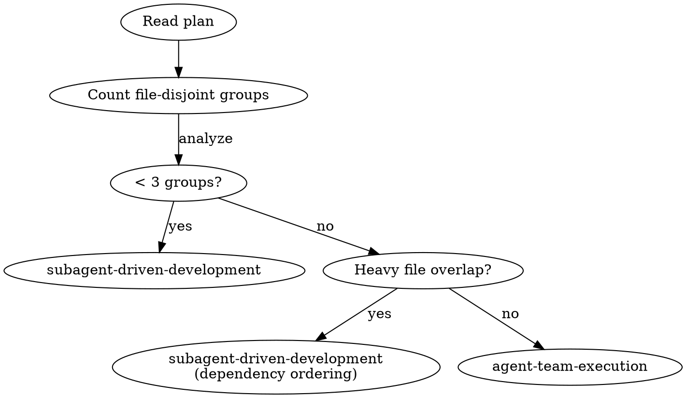

# Agent Team Execution

Execute implementation plans using collaborative agent teams. Lead routes coordination through SendMessage, specialists work in parallel on file-disjoint groups, a reviewer gates every task.

**Prerequisite:** A plan at `docs/plans/*.md` with discrete tasks (see writing-plans skill).

## Mode Selection



## Roles

| Role | Count | Owns | Prompt |
|------|-------|------|--------|
| Lead | 1 | `shared-contracts.md`, TaskList | `./lead-prompt.md` |
| Specialist | 1-N | Assigned files only | `./specialist-prompt.md` |
| Reviewer | 1 | Nothing (read-only) | `./reviewer-prompt.md` |

## Shared Contracts

A single markdown file at workspace root. Specialists read it; only Lead writes it.

**Contains:** Data models/types, API signatures, environment config.
**Template:** `./shared-contracts-template.md`

## Communication

All coordination via SendMessage. No file-based polling or locking. No structured JSON.

- **Contract change:** Specialist requests -> Lead updates file -> Lead notifies affected specialists
- **Completion:** Specialist submits to Reviewer -> Reviewer approves/rejects -> Lead marks done
- **Cross-boundary:** Specialist A requests -> Lead routes to Specialist B -> B confirms -> Lead notifies A
- **Heartbeat:** Specialist signals activity before heavy operations. Lead does not reply.
- **Stall:** Lead pings silent specialist. No response -> reassign.

## Workflow

### Phase 1: Setup (Lead)

1. Read plan, extract tasks with file lists
2. Group tasks into file-disjoint sets
3. Apply mode selection (< 3 groups -> fall back to subagent-driven-development)
4. Create `shared-contracts.md` from `./shared-contracts-template.md`
5. `TeamCreate("{feature-name}-impl")`
6. Spawn specialists with synthesized Mini-Specs (see lead-prompt.md)
7. Spawn one reviewer
8. Create TaskList entries, assign to owning specialists

### Phase 2: Execution

Specialists work in parallel per their prompts. Reviewer processes review requests as they arrive. Lead routes messages and maintains shared state.

### Phase 3: Completion

1. All tasks approved by Reviewer
2. Run full test suite (verification-before-completion)
3. Integration review
4. `shutdown_request` to all agents
5. `TeamDelete`
6. Invoke finishing-a-development-branch

## Deadlock Prevention

| Condition | Detection | Resolution |
|-----------|-----------|------------|
| Specialist stall | No messages or heartbeats | Lead pings: "Status check?" |
| Repeated rejection | Same task rejected 3 times | Lead intervenes directly |
| Cross-boundary blocked | Specialist waiting on another | Lead routes and follows up |
| Crashed specialist | No response to Lead ping | Lead reassigns task |

## Red Flags

- **File-based locking** -- assignment is the only ownership mechanism
- **Polling files for status** -- all status flows through SendMessage
- **Specialists self-marking tasks complete** -- only Lead marks complete after Reviewer approval
- **Skipping the Reviewer** -- every task must be reviewed
- **Lead editing specialist-owned files** -- Lead routes requests only
- **Structured JSON messages** -- plain text via SendMessage only

## Example: Contract Evolution and Cross-Boundary Routing

A plan has 3 file-disjoint groups: model-specialist (Group A), service-specialist (Group B), routes-specialist (Group C).

```
[Parallel start]

model-specialist -> Lead:
  "Requesting contract update: Task type needs dueDate: Date | null."

Lead: [validates against plan, edits shared-contracts.md]
Lead -> service-specialist: "Contract updated: Task.dueDate added. Re-read contracts."
Lead -> routes-specialist: "Contract updated: Task.dueDate added. Re-read contracts."

routes-specialist -> Lead:
  "Need TaskService.listByPriority() but it doesn't exist in contracts.
   service-specialist owns src/services/task.ts."

Lead: [adds listByPriority signature to shared-contracts.md]
Lead -> service-specialist:
  "Contract updated: TaskService.listByPriority added.
   routes-specialist needs this method. Implement and confirm."

service-specialist -> Lead: "Done. listByPriority implemented and tested."
Lead -> routes-specialist: "Change made. Proceed."
```

## Integration

| Skill | Relationship |
|-------|-------------|
| writing-plans | Creates the plan this skill executes |
| subagent-driven-development | Sequential fallback for < 3 tasks or coupled tasks |
| test-driven-development | Specialists follow TDD discipline |
| finishing-a-development-branch | Invoked by Lead after completion |
| verification-before-completion | Lead runs full test suite before finalizing |
